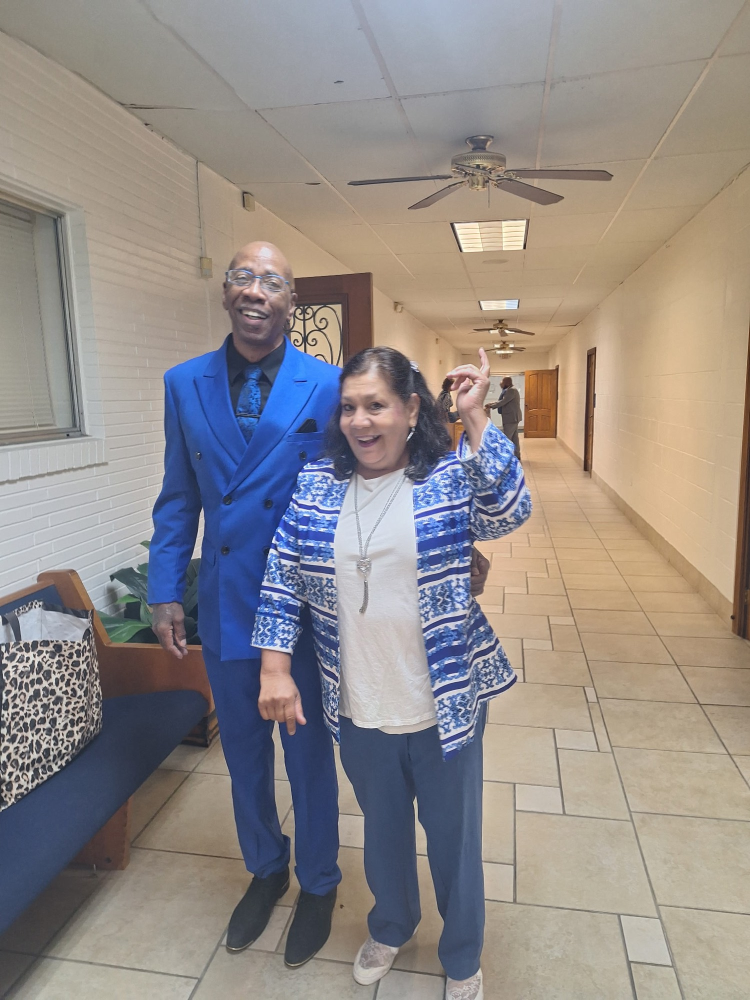

# Image Optimization Guide — Swan Shine Services

## Current Status
- og-image.png: 1.6M (TOO LARGE ❌)
- about-photo.jpg: 494K (acceptable)
- swan-shine-banner.svg: 2.7K (optimal ✅)

## Immediate Actions Required

### 1. Optimize og-image.png (CRITICAL)
**Current:** 1.6M PNG  
**Target:** <300KB JPEG  
**Recommendations:**
- Convert from PNG to JPEG format (typically 60-80% smaller)
- Recommended dimensions: 1200x630px (standard Open Graph size)
- Use compression tools:
  - Online: TinyPNG, Compressor.io, ImageOptim
  - CLI: `ffmpeg -i og-image.png -q:v 2 og-image.jpg`
  - Photoshop: Export as JPEG with 80% quality
- Expected result: ~250-300KB

**Steps:**
1. Export og-image.png as JPEG with quality 75-85%
2. Test dimensions are at least 1200x630px
3. Replace `images/og-image.png` with `images/og-image.jpg`
4. Update all references:
   ```
   - index.html (line ~21, ~23)
   - All location pages
   - All meta tags
   ```

### 2. Add Lazy Loading to Images
**Status:** Currently missing on all images except about-photo.jpg

**Add to about-photo.jpg (already has it) ✅**  
**Check other images for lazy loading**

```html
<!-- Good (has lazy loading and fetchpriority) -->


<!-- Good (lazy loaded, deferred) -->

```

### 3. Consider Responsive Images (Optional)
For future scaling, add:
```html
<picture>
  <source srcset="images/og-image.webp" type="image/webp">
  <source srcset="images/og-image.jpg" type="image/jpeg">
  
</picture>
```

## Performance Impact

**Current State:**
- og-image.png: 1.6M (loads on every page, affects performance)
- Initial load impact: ~1.6MB per visitor

**After Optimization:**
- og-image.jpg: ~250-300K (80-85% reduction!)
- Initial load impact: ~250KB per visitor
- **Performance gain: ~1.3MB saved per page load** 🚀

## Image Checklist

- [ ] Convert og-image.png → og-image.jpg
- [ ] Compress to <300KB
- [ ] Verify dimensions: 1200x630px minimum
- [ ] Update all references (20+ files)
- [ ] Test on mobile and desktop
- [ ] Verify social preview in Google's Social Media Preview tool
- [ ] Update about-photo.jpg metadata (alt text, lazy loading status)

## Tools for Image Optimization

**Online (No installation):**
- https://tinypng.com — PNG/JPEG compression
- https://compressor.io — All formats
- https://www.iloveimg.com — Resize, compress, convert

**Command Line:**
```bash
# JPEG compression
convert og-image.png -quality 80 og-image.jpg

# WebP conversion (future)
cwebp og-image.jpg -q 80 -o og-image.webp

# Batch optimize
for f in images/*.jpg; do jpegoptim --max=80 "$f"; done
```

**Figma / Photoshop:**
- Export as JPEG
- Quality: 75-85
- Progressive JPEG: enabled

## Next Steps

1. Optimize og-image.png using tool of choice
2. Download optimized version
3. Replace file in repo
4. Test social preview (Facebook Debugger, Twitter Card Validator)
5. Commit changes
6. Monitor performance improvement

## References
- [Web.dev Image Optimization](https://web.dev/fast/#optimize-your-images)
- [Open Graph Image Specs](https://ogp.me/)
- [Core Web Vitals - LCP](https://web.dev/lcp/)

---

**Estimated savings:** ~1.3MB per page load  
**Estimated time:** 15 minutes to optimize and deploy
